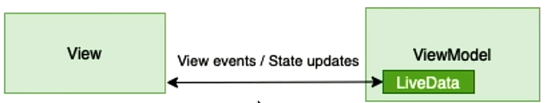
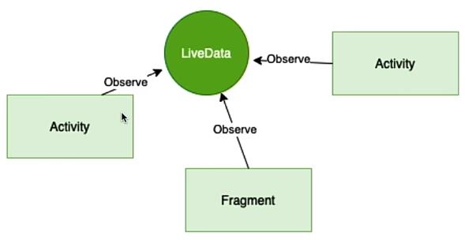

# Introducción a Jetpack Compose

Jetpack Compose es la nueva forma de programar interfaces de usuario propuesta por Google en 2019.

Google liberó su versión Beta en Febrero de 2021. Podemos empezar ya a incluir Jetpack Compose en nuestras apps ya que Google ha anunciado que la especificación del API no variará.

Esta tecnología sigue la misma dirección que Swift UI o Flutter usando un paradigma declarativo. Esto es un buen síntoma ya que diferentes plataformas siguen una misma dirección.

Jetpack Compose se convertirá este año en el nuevo estándar de desarrollo de interfaces de usuario en Android.

Las ventajas principales de Jetpack Compose son:

* Menos código para construir interfaces.
* Código mucho más intuitivo.
* Facilidad a la hora de reutilizar componentes.
* Programación de vistas en Kotlin.

## Imperativa:

Se define paso a paso la casuística de la aplicación, es decir, cuando se pinta algo, cuando cambia de color, etc.... Se indica a través del código lo que tiene que hacer y como tiene que hacerlo.

Manipular las vistas de forma manual

- Aumenta la probabilidad de errores:
- Es fácil olvidarse de actualizar estados de vistas.
- Es fácil crear estados ilegales (conflicto de actualizaciones)
- El mantenimiento de los estados de las vistas se hace complejo.

## Declarativa:

La mayoría de las veces usamos un paradigma imperativo a la hora de programar aplicaciones, aunque la industria está migrando a un modelo de UI declarativo:

Con Jetpack Compose tenemos que cambiar nuestra mentalidad para empezar a utilizar un **paradigma declarativo** :

* Nuestra interfaz de usuario estará controlada por distintos **estados** que se irán actualizando.
* Cada vez que un estado cambie, la interfaz se refrescará y se producirá una  **recomposición** .
* Para lidiar con la  **recomposición** , tendremos que contemplar todos los posibles estados con anterioridad.
* Es costoso en términos computacionales: **Recomposición**.
* Aunque al principio parezca más complicado, este paradigma reduce la inconsistencia de estados, favorece la legibilidad del código y la reutilización de los componentes.
*

## Composición:

Las funciones etiquetadas con una anotación `@composable`

- Funciones que reciben datos y emiten elementos de UI
- Puedes usar for, if, etc para genera la potencia del lenguaje.

Todas las funciones que admiten composición deben ser anotadas con @Composable.

- Las funciones que admiten composición pueden aceptar parámetros. La lógica de la aplicación describe la UI.
- `Text()` es también una función que admite composición y que se encarga de crear el elemento en la UI.

## Modo Preview

De igual forma que teníamos una vista previa para los ficheros XML de Android, también la tenemos para el código que construimos con Jetpack Compose  *[@Preview](https://github.com/Preview "@Preview")* .

Tenemos tres tipos de modo de maquetación:  *Code* , *Split* (vista recomendada) y  *Design* .

*Split* y *Design* incorporan un modo interactivo (Interactive) que permite al desarrollador interactuar con la interfaz al igual que si estuviese interactuando con la aplicación móvil en un emulador.

Para que nuestra interfaz aparezca en el modo interactivo tenemos que crear una función `@Composable` y anotarla con la anotación `@Preview`.

```kotlin
@Preview(showBackground = true)  
@Composable  
fun DefaultPreview() {  
    MyApplicationTheme {  
      Greeting("mates!!")
    }  
}
```

Recuerda intentar indicar en la sección de `@Preview` el mismo código que le pasas a la función `setContent`. De esta forma siempre podrás ver en la previsualización el contenido final de la pantalla.

```kotlin
setContent {  
  MyApplicationTheme {  
      Surface(color = MaterialTheme.colors.background) {  
          Greeting("mates!!")  
      }  
  }
}
```

Si la pantalla de preview desaparece, recuerda cerrar la clase y volver a abrirla. Android Studio realiza un análisis de código sobre la clase en busca de una función *[@Preview](https://github.com/Preview "@Preview")* para lanzar la previsualización.

Hablaremos más adelante sobre el parámetro  *showBackground* .

# Primeros componentes

Jetpack Compose se basa en funciones "componibles". Estas funciones le permiten definir la interfaz de usuario de tu aplicación mediante la descripción de cómo debería verse y proporcionando dependencias de datos, en lugar de centrarse en el proceso de construcción de la interfaz de usuario (inicializar un elemento, adjuntarlo a un padre, etc.). Para crear una función componible, simplemente agregue la anotación `@Composable` al nombre de la función.

## Mostrar etiquetas:

Como se puede observar en el código de abajo, la función `Greeting()` contiene un elemento  `Text()`, y esta también es una función etiquetada con `@Composable`.

```kotlin
@Composable  
fun Greeting(name: String) {  
    Text(text = "Hello $name!")  
}
```

`Text()` es una función propia del SDK de Android que admite composición.

`Text()` admite por parámetro argumentos como  `text`, `modifier`, `color`, `fontSize` , etc.

Dichos parámetros pueden ser requeridos (como en el caso de  `text`) o no requeridos con valores por defecto (`color`, `modifier`). Consulta los parámetros de la función `Text()`.

Siempre que cambiemos valores de la interfaz, recuerda usar la opción *Build Refresh* para actualizar los valores en la Preview.

Se pueden incluir funciones Compose definidas en el SDK de Android directamente en la función `setContent`. El bloque `setContent` define el diseño de la interface, por tanto, en este bloque, llamaremos a las funciones componibles. **Las funciones componibles solo se pueden llamar desde otras funciones componibles**.

```kotlin
class MainActivity : ComponentActivity() {  
    override fun onCreate(savedInstanceState: Bundle?) {  
        super.onCreate(savedInstanceState)  
        setContent {  
          Text(text = "Hello mates!!")  
        }  
    }  
}
```

El nombre de las funciones que admiten composición deben empezar por letra mayúscula, ya que estas funciones actúan como widgets.

Las funciones *[@Composable](https://github.com/Composable "@Composable")* *no están ligadas* a ninguna clase, pueden ser definidas en cualquier sitio.

> En Jetpack Compose Desktop, el contenido tendrá que ir dentro de la función `application`, punto de entrada para la aplicación, y que a la vez recibe un componente `@Composable`, normalmente un componente `Window`. Como puedes apreciar no hay rastros de `Activity`, ni de `setContent`.

Un Ejemplo de lo anterior:

```kotlin
fun main() = application {
    Window(onCloseRequest = ::exitApplication) {
        App()
    }
}
```

y la función `App` estará definida como `@Composable`.

## Creación de un botón y manejo de eventos

Al igual que `Text()` , `Button()` es otra función composable ofrecida por el SDK de Android.

```kotlin
@Composable  
fun GreetingButton() {  
    Button(onClick = {  
        // Do something  
    }) {

    }  
}
```

Uno de los parámetros que recibe la función `Button()` es la función bajo el argumento  `onClick` , que actúa como callback, y que será notificado cada vez que se produzca un evento click sobre el botón.

Button tiene como argumento una función lambda, que admite composición, llamada  `RowScope`. Mediante esta función podemos añadir textos, iconos, imágenes, etc, ya que `Button()` no tiene ningún contenido por defecto.

```kotlin
@Composable  
fun GreetingButton() {  
    Button(onClick = {  
      // Do something  
    }) {  
      GreetingText(name = "mates!")  
    }  
}
```

`RowScope` es un contenedor de elementos de forma horizontal. Si añadimos más componentes al `RowScope` del componente `Button()` éstos se alinearán consecutivamente de forma horizontal.

# Modificar componentes

## Modifiers

Todos los elementos Composable que ofrece el SDK de Android aceptan un parámetro llamado  *Modifier* .

`Modifier` es una clase estática a la que se puede acceder sin necesidad de ser instanciada y desde cualquier lugar de nuestra aplicación. Tiene funciones para especificar parámetros como la anchura, altura, el tamaño total, padding, etc, de un componente.

```kotlin
@Composable  
fun GreetingText(name: String) {  
    Text(text = "Hello $name!",  
      modifier = Modifier.width(80.dp))  
}
```

Los métodos de `Modifier()` implementan **method chaining pattern** de forma que permiten concatenar varias llamadas a métodos en la misma cadena pudiendo establecer varios parámetros en una única expresión.

```kotlin
@Composable  
fun GreetingText(name: String) {  
    Text(text = "Hello $name!",  
      modifier = Modifier  
            .width(80.dp)  
            .height(240.dp))  
}
```

Los valores para `width()`, `height()`, y otras funciones, se establece en `DP`. Los `DP` son objetos de la inline class `DP`.

Como alternativa, usando el método `size()` podemos establecer valores para la anchura y para la altura de un componente, pasándole valores DP.

```kotlin
@Composable  
fun GreetingText(name: String) {  
    Text(text = "Hello $name!",  
      modifier = Modifier  
            .size(width = 80.dp, height = 240.dp))  
}
```

Si no se indican los parámetros de `width()`, `height()`, el mismo valor será aplicado para ambos parámetros haciendo que el componente sea cuadrado.

```kotlin
@Composable  
fun GreetingText(name: String) {  
    Text(text = "Hello $name!",  
      modifier = Modifier  
            .size(80.dp))  
}
```

`fillMaxSize` permite al componente ocupar todo el espacio que ocupa su componente padre.

```kotlin
@Composable  
fun GreetingText(name: String) {  
    Text(text = "Hello $name!",  
      modifier = Modifier  
            .fillMaxSize())  
}
```

`fillMaxHeight` permite al componente ocupar todo el espacio en altura que ocupa su componente padre. La anchura se mantiene como `wrap_content`.

```kotlin
@Composable  
fun GreetingText(name: String) {  
    Text(text = "Hello $name!",  
      modifier = Modifier  
            .fillMaxHeight())  
}
```

`fillMaxWidth` permite al componente ocupar todo el espacio en anchura que ocupa su componente padre. La altura se mantiene como `wrap_content`.

```kotlin
@Composable  
fun GreetingText(name: String) {  
    Text(text = "Hello $name!",  
      modifier = Modifier  
            .fillMaxWidth())  
}
```

`fillMaxWidth()` y `fillMaxHeight()` aceptan como argumento fracciones (de `0` a `1`) que indican el máximo espacio que queremos que ocupe nuestro componente dentro de su componente padre.

```kotlin
@Composable  
fun GreetingText(name: String) {  
    Text(text = "Hello $name!",  
      modifier = Modifier  
            .fillMaxWidth(0.5f))  
}
```

## Eventos de click, padding y orden de modificadores

La clase `Modifier` permite hacer cualquier componente Compose clickable. Al igual que en el caso del componente  `Button()` , `Modifier` acepta una función como parámetro del método `clickeable()` que se invocará cada vez que se produzca un evento de click sobre el componente.

```kotlin
@Composable  
fun GreetingText(name: String) {  
    Text(text = "Hello $name!",  
        modifier = Modifier  
            .width(80.dp)  
            .height(240.dp)  
            .clickable {  
              //Do something  
            })  
}
```

Recuerda que activando la opción **Interactive Mode** de la preview de Compose (en la ruta: `File -> Settings -> Experimental`, al ser experimental puede no aparecer o fallar) podrás ver cómo tu elemento ahora se resalta cuando es seleccionado indicando que se puede hacer click sobre él.

Puedes añadir padding (El padding es un espacio situado entre los bordes de la vista y su contenido) a tu componente usando el método `padding()` del `Modifier`. El valor se establece en `DP`.

```kotlin
@Composable  
fun GreetingText(name: String) {  
    Text(text = "Hello $name!",  
          modifier = Modifier  
            .padding(all = 20.dp)  
    )  
}
```

El método `padding()` puede ser aplicado a todos los lados del componente usando **all** o indicar el lado o los lados específicos:  **top** ,  **start** , **bottom** y **end** donde se desee aplicar.

```kotlin
@Composable  
fun GreetingText(name: String) {  
    Text(text = "Hello $name!",  
        modifier = Modifier  
            .width(80.dp)  
            .height(240.dp)  
            .clickable {  
              //Do something  
            })
            .padding(top = 20.dp)
}
```

```kotlin
@Composable  
fun GreetingText(name: String) {  
    Text(text = "Hello $name!",  
        modifier = Modifier  
            .width(80.dp)  
            .height(240.dp)  
            .clickable {  
              //Do something  
            })
            .padding(top = 20.dp, bottom = 20.dp)
}
```

**El orden de los modificadores importa**. Si se aplica el método `padding()` como último elemento de la cadena el componente `Text()`* será clickable en su totalidad, incluyendo las dimensiones del padding. Si el método es aplicado antes que el método `clickeable()` la zona clickable del componente excluirá el padding indicado.

```kotlin
@Composable  
fun GreetingText(name: String) {  
    Text(text = "Hello $name!",  
        modifier = Modifier  
            .width(80.dp)  
            .height(240.dp)
            .padding(top = 20.dp, bottom = 20.dp)  
            .clickable {  
                  //Do something  
                })
}
```

# Customizar un componente

## TextStyle

La clase `TextStyle` permite customizar aspectos de un componente Composable:

* Color del texto.
* Tamaño del texto.
* Tipografía.
* Espacio entre letras.
* Indentación.
* etc.

```kotlin
@Composable  
fun GreetingText(name: String) {  
    Text(text = "Hello: $name",  
        style = TextStyle(  
            color = Color.Red,  
            fontWeight = FontWeight.SemiBold,  
            fontSize = 18.sp)  
    )  
}
```

Jetpack Compose ya provee de estilos, llamados [Material Design](https://material.io/design) (consulta la URL), y como hemos comentado ya están predefinidos para poder usar en nuestros componentes a través de la clase `MatherialTheme`. Los siguientes estilos son de la clase `TextStyle`:

* `h1`.
* `h2`.
* `button`.
* `caption`.
* `body`.
* etc.

Podemos aplicar un `style` de tipo `TextStyle` predefinido como por ejemplo `MaterialTheme.typography.h5` y sobrescribir algún parámetro concreto por ejemplo el `fontWeight` haciendo uso de los valores ya predefinidos como `FontWeight.SemiBold`

```kotlin
@Composable  
fun GreetingText(name: String) {  
    Text(text = "Hello: $name",  
        style = MaterialTheme.typography.h5,  
        fontWeight = FontWeight.SemiBold  
    )  
}
```

`FontWeight` y `MatherialTheme` son una clase companion object de Kotlin, en las que todos sus componentes son estáticos y accesible desde los componentes.

# Contenedores

## Layouts: El componente `Surface`

El componente `Surface()` es un componente `@Componsable` que representa un bloque de UI que podemos añadir a nuestra interfaz y que puede tener color, modificadores, etc. y contener otros componentes, en concreto uno, a través de una lamda.
Si no le aplicamos modificadores no tendrá dimensiones y no podrá verse en la pantalla, por tanto aplicamos `fillMaxWidth()`.
Este componente puede formar nuestro componente principal `MainScreen` `@Composable` en la que ir colocando otros componentes.

```kotlin
@Composable  
fun MainScreen() {  
    Surface(  
        color = Color.LightGray,  
        modifier = Modifier.fillMaxSize()  
    ) {
        //Aquí un componente
    }  
}
```

Podemos añadir otros componentes dentro de `Surface()`.

```kotlin
@Composable  
fun MainScreen() {  
    Surface(  
        color = Color.LightGray,  
        modifier = Modifier.fillMaxSize()  
    ) {  
        Text(  
            text = "Hi mates!!",  
            style = MaterialTheme.typography.h5,  
            modifier = Modifier.wrapContentSize()  
        )  
    }  
}
```

`Text()` utiliza el método `wrapContentSize()` como modificador que indica que use solo el espacio necesario para pintar su contenido, en este caso `Hi mates!`. `wrapContentSize()` aplicará una alineación automática en `Surface()`, `Alignment.Center`, y situará el componente `Text()`en el centro del componente. Aunque esto se puede cambiar haciendo uso de la clase `Alignment`, ya que tiene multitud de valores para posicionar un componente dentro de su componente padre.

También podemos anidar componentes `Surface()`.

```kotlin
@Composable  
fun MainScreen() {  
    Surface(  
        color = Color.LightGray,  
        modifier = Modifier.fillMaxSize()  
    ) {  
          Surface(  
              color = Color.Green,  
              modifier = Modifier.wrapContentSize(Alignment.TopEnd)  
          ) {  
              Text(  
                  text = "Hi mates!!",  
                  style = MaterialTheme.typography.h5,
                  modifier = Modifier.padding(20.dp)
              )  
          }  
    }
}
```

Anidando componentes de esta forma se puede establecer un background para el componente `Text()`. El modificador `wrapContentSize()` puede moverse ahora al componente padre `Surface()`, y por tanto, este componente `Surface()` ocupará solo lo que ocupe el componente `Text()` que contiene.

Recordamos que el componente `Surface()` acepta **un solo** componente hijo. Más adelante veremos cómo añadir varios componentes dentro de un componente padre.

## Otros contenedores

Para situaciones en las que se tengan más de un componente hijo, Jetpack Compose ofrece los componentes: **Row**, **Column** y **Box** :

* **Row**: Componente que puede albergar contenido de forma horizontal.
* **Column**: Componente que puede albergar contenido de forma vertical.
* **Box**: Componente que permite tener componentes encima o debajo de otros componentes de forma sencilla.

### Row

Al igual que  **Button**, **Row** contiene un **RowScope** que nos indica que podemos añadir componentes que admiten composición en su interior. Como indicamos anteriormente, dichos componentes se alinearán de forma horizontal.

A continuación, se muestra un ejemplo de componente **Row** con dos componentes **Surface** cuadrados que se alinean horizontalmente:

```kotlin
@Composable  
fun MainScreen() {  
    Surface(  
        color = Color.LightGray,  
        modifier = Modifier.fillMaxSize()  
    ) {  
      Row {  
        Surface(  
            color = Color.Green,  
            modifier = Modifier.size(60.dp)  
        ) {}  
        Surface(  
            color = Color.Black,  
            modifier = Modifier.size(60.dp)  
        ) {}  
 } }}
```

Si vemos los argumentos que acepta el componente **Row** podemos observar dos muy interesantes: **verticalAlignment** y **horizontalArrangement** .

#### verticalAlignment

Mediante este argumento podemos indicar cómo queremos posicionar los hijos de nuestro componente **Row** con respecto a la línea vertical. Este argumento solo acepta parámetros del tipo **Alignment.Vertical** (valores como: **Top**, **CenterVertically** y **Bottom** ).

En el código que se muestra a continuación los hijos de posicionan centrados verticalmente con **CenterVertically** :

```kotlin
@Composable  
fun MainScreen() {  
    Surface(  
        color = Color.LightGray,  
        modifier = Modifier.fillMaxSize()  
    ) {  
        Row(verticalAlignment = Alignment.CenterVertically) {  
            Surface(  
                color = Color.Green,  
                modifier = Modifier.size(60.dp)  
            ) {}  
            Surface(  
                color = Color.Black,  
                modifier = Modifier.size(60.dp)  
            ) {}  
        }
    }
}
```

#### `horizontalArrangement`

Este argumento nos permite indicar cómo disponer los elementos hijos en la línea horizontal. Acepta valores de la clase `Arrangement.Horizontal` (valores como: `Start`, `End` o `Center`).

En el código que se muestra a continuación los hijos se posicionan centrados verticalmente y horizontalmente con `Arrangement.Center`:

```kotlin
@Composable  
fun MainScreen() {  
    Surface(  
        color = Color.LightGray,  
        modifier = Modifier.fillMaxSize()  
    ) {  
        Row(  
            verticalAlignment = Alignment.CenterVertically,
            horizontalArrangement = Arrangement.Center  
        ) {  
            Surface(  
                color = Color.Green,  
                modifier = Modifier.size(60.dp)  
            ) {}  
            Surface(  
                color = Color.Black,  
                modifier = Modifier.size(60.dp)  
            ) {}  
        }
    }
}
```

### `Column`

Como indicamos anteriormente, el componente `Column` alberga hijos de forma vertical.

A continuación, se muestra un ejemplo de componente `Column` con dos componentes `Surface` cuadrados que se alinean verticalmente:

```kotlin
@Composable  
fun MainScreen() {  
    Surface(  
        color = Color.LightGray,  
        modifier = Modifier.fillMaxSize()  
    ) {  
        Column {  
            Surface(  
                color = Color.Green,  
                modifier = Modifier.size(60.dp)  
            ) {}  
            Surface(  
                color = Color.Black,  
                modifier = Modifier.size(60.dp)  
            ) {}  
        } 
    }
}
```

De forma similar al componente `Row`, `Column` acepta los siguientes argumentos: `horizontalAlignment` y `verticalArrangement`.

#### `horizontalAlignment`

Mediante este argumento podemos indicar cómo queremos posicionar los hijos de nuestro componente `Column` con respecto a la línea horizontal. Este argumento solo acepta parámetros del tipo `Alignment.Horizontal` (valores como: `Start`, `CenterHorizontally` y `End`).

En el código que se muestra a continuación los hijos se posicionan centrados horizontalmente con `CenterHorizontally`:

```kotlin
@Composable  
fun MainScreen() {  
    Surface(  
        color = Color.LightGray,  
        modifier = Modifier.fillMaxSize()  
    ) {  
        Column(  
            horizontalAlignment = Alignment.CenterHorizontally  
        ) {  
            Surface(  
                color = Color.Green,  
                modifier = Modifier.size(60.dp)  
            ) {}  
            Surface(  
                color = Color.Black,  
                modifier = Modifier.size(60.dp)  
            ) {}  
         } 
    }
}
```

#### `verticalArrangement`

Este argumento permite indicar cómo disponer los elementos hijos en la línea vertical. Acepta valores de la clase `Arrangement.Vertical` (valores como: `Top`, `Bottom`o`Center`).

En el código que se muestra a continuación los hijos se posicionan centrados verticalmente y horizontalmente con `Arrangement.Center`

```kotlin
@Composable  
fun MainScreen() {  
    Surface(  
        color = Color.LightGray,  
        modifier = Modifier.fillMaxSize()  
    ) {  
        Column(  
            horizontalAlignment = Alignment.CenterHorizontally,  
            verticalArrangement = Arrangement.Center  
        ) {  
            Surface(  
                color = Color.Green,  
                modifier = Modifier.size(60.dp)  
            ) {}  
            Surface(   
                color = Color.Black,  
                modifier = Modifier.size(60.dp)  
            ) {}  
        }
    }
}
```

# Reusar componentes

Tomando como ejemplo uno de los códigos vistos anteriormente, podemos observar que los hijos de `Column` son dos cuadrados representados con un componte `Surface` que son iguales y estamos añadiendo código repetitivo.

```kotlin
@Composable
fun MainScreen() {
    Surface(
        color = Color.LightGray,
        modifier = Modifier.fillMaxSize()
    ) {
      Column {
          Surface(
              color = Color.Green,
              modifier = Modifier.size(60.dp)
          ) {}
          Surface(
              color = Color.Black,
              modifier = Modifier.size(60.dp)
          ) {}
        }
    }
}
```

El componente `Surface` puede abstraerse en una función de composición específica y ser reutilizado de una forma mucho más sencilla.

Abstracción en componente `MySquare`:

```kotlin
 @Composable
fun MySquare() {
    Surface(
        color = Color.Green,
        modifier = Modifier.size(60.dp)
    ) {}
}
```

Utilización de componente `MySquare`:

```kotlin
@Composable
fun MainScreen() {
    Surface(
        color = Color.LightGray,
        modifier = Modifier.fillMaxSize()
    ) {
        Column {
            MySquare()
            MySquare()
            MySquare()
        }
 }}
```

Podemos parametrizar nuestro nuevo componente `MySquare` pasándole como argumento el color.

```kotlin
@Composable
fun MySquare(color: Color) {
    Surface(
        color = color,
        modifier = Modifier.size(60.dp)
    ) {}
}

@Composable
fun MainScreen() {
    Surface(
        color = Color.LightGray,
        modifier = Modifier.fillMaxSize()
    ) {
        Column {
            MySquare(Color.Red)
            MySquare(Color.Yellow)
            MySquare(Color.Green)
        }
    }
 }
```

# Cómo funciona State

## Recomposición

La recomposición es el proceso que se encarga de actualizar la pantalla, en concreto, los componentes que admiten composición.

Para lanzar la recomposición es indispensable tener una implementación de `State`  para cada componente composable, al menos para los que tienen un estado que cambia o puede cambiar a lo largo del tiempo.

## State

El `State` de una aplicación se puede definir como **cualquier valor o dato que puede cambiar a lo largo del tiempo**, ya sea por un evento click en una lista, una entrada de datos en un formulario de texto, etc.

En Jetpack Compose `State` es un componente más del propio componente composable.

## Flujo de datos unidireccional

El flujo de UI en Jetpack Compose puede pensarse como un bucle en el que se dispara un evento que actualiza un `State`, por ejemplo, un click a un botón que desencadena la actualización de una lista. Este nuevo valor de `State` pasa por todo el árbol de la UI de elementos composables vinculados a ese `State`, es decir, que deben tener en cuenta los posibles valores de dicho `State` y actualizar la UI.

.

Este flujo de **`Event` - `State`** es unidireccional lo que proporciona ciertas ventajas como:

* **Mayor testeabilidad** : `State` está desacoplado de la UI, es muy fácil hacer tests de ambas partes de forma aislada.
* **Mayor consistencia en la UI** : Este flujo obliga a que todos los `State` sean reflejados en la UI de forma continua eliminando las posibles inconsistencias entre los componentes visuales y los estados.

## Controlar State en una lista

Partimos de un componente `MainScreen` que contiene una lista `StudentList` de componentes `StudentText` y un `Button` que añade nuevos elementos a la lista de estudiantes.

**`MainScreen`**

```kotlin
@Composable
fun MainScreen() {
    Surface(
        color = Color.LightGray,
        modifier = Modifier.fillMaxSize()
    ) {
        StudentList()
    }
}
```

**`StudentList`**

```kotlin
@Composable
fun StudentList() {
    val students = mutableListOf("Juan", "Victor", "Esther", "Jaime")
    Column(
        modifier = Modifier.fillMaxSize(),
        horizontalAlignment = Alignment.CenterHorizontally
    ) {
        for (student in students) {
            StudentText(name = student)
        }
        Button(
            onClick = { students.add("Miguel") },
        ) {
            Text(text = "Add new student")
        }
    }
}
```

**`StudentText`**

```kotlin
@Composable
fun StudentText(name: String) {
    Text(
        text = name,
        style = MaterialTheme.typography.h5,
        modifier = Modifier.padding(10.dp)
    )
}
```

Si activamos el modo interactivo y pulsamos el botón añadir podemos observar cómo la lista no añade el nuevo valor aunque modifiquemos la lista de estudiantes. Esto es debido a que no se ha implementado ningún `State` a la lista de datos que dispare la recomposición.

Para añadir `State` a la lista es necesario crear la lista del tipo `SnapshotStateList` a través del método `mutableStateListOf`

```kotlin
val studentsState = mutableStateListOf("Juan", "Victor", "Esther", "Jaime")
```

Observamos que el compilador nos obliga a utilizar el bloque `remember`. Este bloque permite que el estado sea recordado durante la recomposición y que no desaparezca después.

```kotlin
val studentsState = remember { mutableStateListOf("Juan", "Victor", "Esther", "Jaime") }
```

Finalmente, la función StudentList queda de esta forma:

```kotlin
@Composable
fun StudentList() {
    val studentsState = remember { mutableStateListOf("Juan", "Victor", "Esther", "Jaime") }
    Column(
        modifier = Modifier.fillMaxSize(),
        horizontalAlignment = Alignment.CenterHorizontally
    ) {
        for (student in studentsState) {
            StudentText(name = student)
        }
        Button(
            onClick = { studentsState.add("Miguel") },
        ) {
            Text(text = "Add new student")
        }
    }
}
```

Si activamos ahora el modo interactivo y pulsamos el botón añadir vemos cómo el nuevo elemento se añade de forma satisfactoria al final de la lista.

# El patrón State Hoisting

El patrón **State Hosting** consiste en mover los estados al componente padre de tal forma que los hijos nunca tengan que manejarlos.

El principal objetivo es reemplazar la variable de estado por dos argumentos en cada función composable hija:

* `value: T` El valor para mostrar.
* `onValueChange: (T) -> Unit` Evento (lambda) que dispara la modificación del `State`.

El patrón **State Hosting** ofrece las siguientes ventajas:

* Manejar los estados de forma única y centralizada.
* Solo las funciones que manejan estados pueden modificarlos.
* Funciones composable hijas no tienen que preocuparse por manejar estados, solo:
  * pintar información: Los datos tiene un flujo top-down
  * elevar eventos: Los eventos tiene un flujo bottom-up.


[Mas informacion](https://developer.android.com/jetpack/compose/mental-model?hl=es-419#paradigm)

A continuación, vamos a aplicar el patrón **State Hosting** a la aplicación de alumnos de la lección anterior. Para ello, seguiremos los siguientes pasos:

* Mover la lista de estudiantes al punto de entrada `MainScreen`.
* Parametrizar la función `StudentList` con el valor a mostrar y la función lambda de eventos de click.

Modificamos la función:

```kotlin
@Composable
fun StudentList(students: List<String>, onButtonClick: () -> Unit) {
    Column(
        modifier = Modifier.fillMaxSize(),
        horizontalAlignment = Alignment.CenterHorizontally
    ) {
        for(student in students) {
            StudentText(name = student)
        }
        Button(
            onClick = onButtonClick,
        ) {
            Text(text = "Add new student")
        }
    }
}
```

Y modificamos el código en la que se hace uso de esta función:

```kotlin
@Composable  
fun MainScreen() {  
    val studentsState = remember { mutableStateListOf("Esther", "Jaime") }  
    Surface(  
        color = Color.LightGray,  
        modifier = Modifier.fillMaxSize()  
    ) {  
        StudentList(studentsState) {  
            studentsState.add("Miguel")  
        }  
    }
 }
```

Como podemos observar en el código, el componente `StudentList` ya no sabe nada sobre estados. Le hemos aplicado las dos premisas del patrón **State Hoisting** la parametrización de la lista de estudiantes y la función para elevar los eventos de click del botón añadir. Ahora es el componente `MainScreen` el encargado de manejar estados y de modificarlos.

# El componente `TextField` con State

El componente `TextField` es el equivalente al componente `EditText` de Android tradicional.

En esta lección veremos cómo manejar correctamente el estado de este componente a través de `State`.

Vamos a iterar nuestra aplicación de añadir alumnos incorporando un campo de introducción de texto `TextField` que permita al usuario escribir el nombre del alumno.

Cuando usamos `TextField`, es prácticamente obligatorio hacerlo de la mano de `State` de forma que podamos ver cómo el valor del componente cambia cada vez que se introduce texto tal y como se muestra a continuación:

```kotlin
val newStudentState = remember { mutableStateOf("")}  
TextField(  
    value = newStudentState.value,  
    onValueChange = {  
        newInput -> newStudentState.value = newInput  
    }  
)
```

Como vemos en el código anterior, se usa `mutableStateOf` para guardar el estado del componente `TextField`.

Podríamos incorporar este snippet de código en nuestro componente `StudentList` pero implementaremos **State Hoisting** para no manejar estados en componentes internos y elevarlos al componente `MainScreen`.

```kotlin
@Composable  
fun StudentList(
    students: List<String>,  
    onButtonClick: () -> Unit,  
    studentName: String,  
    onStudentNameChange: (String) -> Unit  
) {  
    Column(  
        modifier = Modifier.fillMaxSize(),  
        horizontalAlignment = Alignment.CenterHorizontally  
    ) {  
        for (student in students) {  
            StudentText(name = student)  
        }  
        TextField(  
            value = studentName,  
            onValueChange = onStudentNameChange  
        )  
        Button(  
            onClick = onButtonClick
        ) {  
            Text(text = "Add new student")  
        } 
    }
}
```

En el código anterior se puede observar como parametrizamos `StudentList` con los siguientes argumentos:

* `studentName: String` Contiene el valor del `TextField`. Como veremos en `MainScreen` a continuación, hace referencia a un `State`.
* `onStudentNameChange: (String)->Unit` lambda que eleva el valor del componente `TextField` cuando cambia.

```kotlin
@Composable  
fun MainScreen() {  
    val studentsState = remember { mutableStateListOf("Esther", "Jaime") }  
    val newStudentState = remember { mutableStateOf("") }  
    Surface(  
        color = Color.LightGray,  
        modifier = Modifier.fillMaxSize()  
    ) {  
        StudentList(  
            studentsState,  
            { studentsState.add(newStudentState.value) },  
            newStudentState.value,  
            { newStudent -> newStudentState.value = newStudent }  
        )  
    }  
}
```

* `newStudentState: MutableState` el valor de `TextField` es un `State` y todas las variaciones que se produzcan sobre él dispararán la recomposición.
* Vemos como en las lambdas `onButtonClick` y `onStudentNameChange` se inserta un valor en la lista de estudiantes y se modifica el valor del componente `TextField` respectivamente.

# `ViewModel` y `LiveData`

## Introducción a `ViewModel` y `LiveData`

En lecciones anteriores vimos el patrón **State Hoisting** y cómo elevar los estados lo más arriba posible dentro de la jerarquía de componentes composables.

El siguiente objetivo es evitar que nuestras vistas (`Fragments` y `Activities`) sean las encargadas de manejar estados y trasladar dicha responsabilidad al componente `ViewModel`

> `Fragments` y `Activities` son vistas usadas en **Jetpack Compose Android**.

`ViewModel` y `LiveData` son componentes de Jetpack y forman parte de la arquitectura **Model View-View Model (MVVM)** propuesta por Google para el desarrollo de aplicaciones Android.

### `ViewModel`

* Es responsable de preparar y manejar estados para la UI (`Fragments` y `Activities`). Tiene una relación directa con la vista para mostrar los datos.
* Mediante el uso de `ViewModel` seremos capaces de desacoplar la lógica de presentación de los componentes de UI.
* `ViewModel` está directamente relacionado con el modelo de los datos que se van a mostrar en la vista. Esto es debido a que `ViewModel` es parte de la arquitectura  **MVVM** .
* La vista espera un estado de UI proporcionado por `ViewModel` y, a su vez, `ViewModel` podrá actualizar dicho estado de UI si se producen eventos desde la vista.
* En resumen, la vista podrá recibir actualizaciones del estado de UI desde el `ViewModel`.
* En esta arquitectura, la vista no pregunta por el estado de la UI al `ViewModel` continuamente. Tiene la posibilidad de subscribirse al componente `LiveData` dentro de `ViewModel`



### `LiveData`

* `LiveData` es un componente observable, permite que otros componentes se suscriban a él con el fin de ser notificados si se produce algún cambio.
* `LiveData` contiene un estado y su principal responsabilidad es avisar a sus suscriptores cuando dicho estado cambie.
* `Fragments` y `Activities` pueden suscribirse a un componente `LiveData` para ser notificados siempre que se produzca una actualización sobre un `State`.
* Si se produce un evento y el `State` relacionado con el componente `LiveData` cambia, los `Fragments` y `Activities` suscritos a él serán notificados al mismo tiempo.
* `LiveData` está pendiente del ciclo de vida de `Fragments` y `Activities`. Si estos van a un estado `onDestroy` el componente `LiveData` cierra y destruye la conexión con ellos automáticamente.



## `State` en `ViewModel`

Partimos de una aplicación que contiene un componente `TextField()` y un componente `Text()` que refleja los cambios que se producen en `TextField()` cuando el usuario introduce texto en él.

`MainScreen`

```kotlin
@Composable  
fun MainScreen() {  
    val nameState = remember { mutableStateOf("") }  
    Surface(  
        color = Color.LightGray,  
        modifier = Modifier.fillMaxSize()  
    ) {  
        MainLayout(  
            nameState.value  
        ) { newName -> nameState.value = newName }  
    }
}
```

`MainLayout`

```kotlin
@Composable  
fun MainLayout(  
    name: String,  
    onTextFieldChange: (String) -> Unit  
) {  
    Column(  
        modifier = Modifier.fillMaxSize(),  
        horizontalAlignment = Alignment.CenterHorizontally  
    ) {  
        TextField(  
            value = name,  
            onValueChange = onTextFieldChange  
        )  
        Text(text = name)  
    }  
}
```

El siguiente paso será mover `nameState` a un componente `ViewModel`. Para ello, creamos una nueva clase `MainViewModel` que herede de `ViewModel` como se muestra a continuación:

```kotlin
class MainViewModel: ViewModel() {  

    val textFieldState = MutableLiveData("")  

    fun onTextChange(newText: String) {  
        textFieldState.value = newText  
    }  
}
```

`textFieldState: MutableLiveData` refleja ahora el estado del dato al cual nuestra UI tendrá que suscribirse para recibir actualizaciones.

A través del método público `onTextChange`, la UI mandará el evento de cambio de texto que genere el componente `TextField`.

Para leer los datos de nuestro nuevo `MainViewModel` desde la vista `MainScreen` tendremos que modificar el componente de la siguiente forma:

```kotlin
@Composable  
fun MainScreen(viewModel: MainViewModel = MainViewModel()) {  
    val nameState = viewModel.textFieldState.observeAsState("")  
    Surface(  
        color = Color.LightGray,  
        modifier = Modifier.fillMaxSize()  
    ) {  
        MainLayout(  
            nameState.value  
        ) { newName -> viewModel.onTextChange(newName) }  
    }
}
```

El valor de `nameState` proviene ahora del componente `LiveData` definido en nuestro nuevo `MainViewModel`.

Necesitamos que `nameState` sea un `State` y no un `LiveData`. Para conseguir esto, hay que añadir una nueva dependencia a nuestro fichero `build.gradle`, permitiendo el uso del método `observeAsState` encargado de la conversión a `State`:

```groovy
implementation "androidx.compose.runtime:runtime-livedata:$compose_version"
```

Los eventos de `TextField` recogidos en la lambda son enviados ahora a nuestro `MainViewModel` y a su vez notificados a `LiveData` a través del método `onTextChange`.

# Bibliografía

- https://github.com/JetBrains/compose-jb/tree/master/tutorials - Tutorial sobre los principales componentes de **Jetpack Compose Desktop**
- https://plugins.jetbrains.com/plugin/10942-kotlin-fill-class - Plugin para rellenar los  argumentos de clases, muy util en Jetpack Compose
- https://medium.com/droid-latam/jetpack-compose-i-motivaci%C3%B3n-50e085543923 - Que es Jetpack Compose
- https://medium.com/@facundomr/jetpack-compose-ii-funciones-composable-8d4d1d40ed44 - Funciones @Composables
- https://medium.com/@facundomr/jetpack-compose-iii-flujo-de-datos-y-eventos-e62d5f8bce6f - Arquitectura de la IU, flujo de informacion y eventos.
