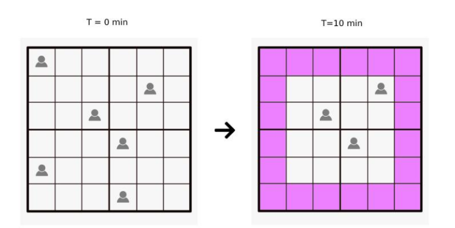
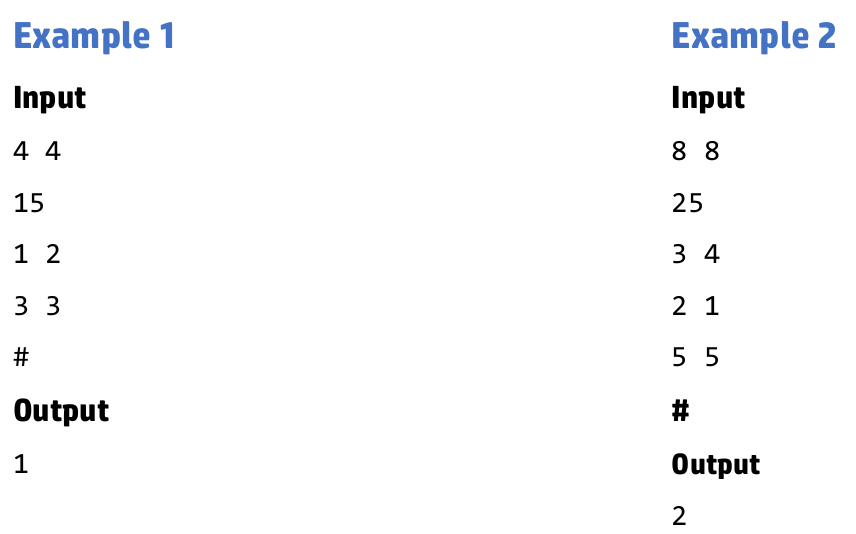

# El juego Battle Royal.

## Introducción
Trabajas en el desarrollo de un nuevo juego Battle Royal. 

Los jugadores lucharán entre sí dentro de un tablero fijo, pero cada 10 minutos el tamaño del mapa se reduce y cualquier jugador fuera de los límites perderá el juego.

Se te pide que desarrolles un pequeño prototipo de esa funcionalidad para comprobar cómo funcionarán los límites del mapa. 

> **PISTA**: El mapa se define NxN.
> 
> Las posiciones válidas de los jugadores van de 0 a N-1 
> 
>¡Observe que el mapa se reduce por todos lados! (arriba, abajo, derecha, izquierda) y que los jugadores no se muevan de sus posiciones 
 
Aquí tienes un ejemplo:



## Entrada 

La entrada será: 
- El nombre de archivo se pasará por linea de comandos: `$ battleRoyal test-1.in`
- El tamaño del tablero, referente al máximo de filas y columnas (sólo los cuadrados son válidos 3x3,4x4,5x5 etc).
- El tiempo de partida,  en minutos, en el que queremos evaluar el número de jugadores restantes.
- Varias posiciones en el mapa, representando la posición del jugador al comienzo del partido. (T=0 min) 
  
El proceso debería dejar de leer posiciones de jugador cuando el programa encuentra el carácter '#'. 

### Ejemplo de entrada
```
4 4 
15 
1 2 
3 3
```

En este ejemplo, la primera línea describe que se trata de un mapa 4x4. 
La segunda línea se refiere a que se evaluará 15 minutos desde el inicio del partido. 
La tercera línea proporciona la posición de un jugador en la fila 1 y la columna 2. 
En la cuarta línea se establece otra posición de jugador en la fila 3 y la columna 3. 
Finalmente, el carácter '#' marca detener la lectura del archivo de entrada. 

## Salida

- La salida será en un archivo con el mismo nombre que el de entrada, pero con la extensión `ans`: `test-1.ans`  
- La salida será el número de jugadores que permanecen vivos en el partida en ese momento específico.

## Ejemplos 
