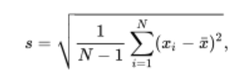
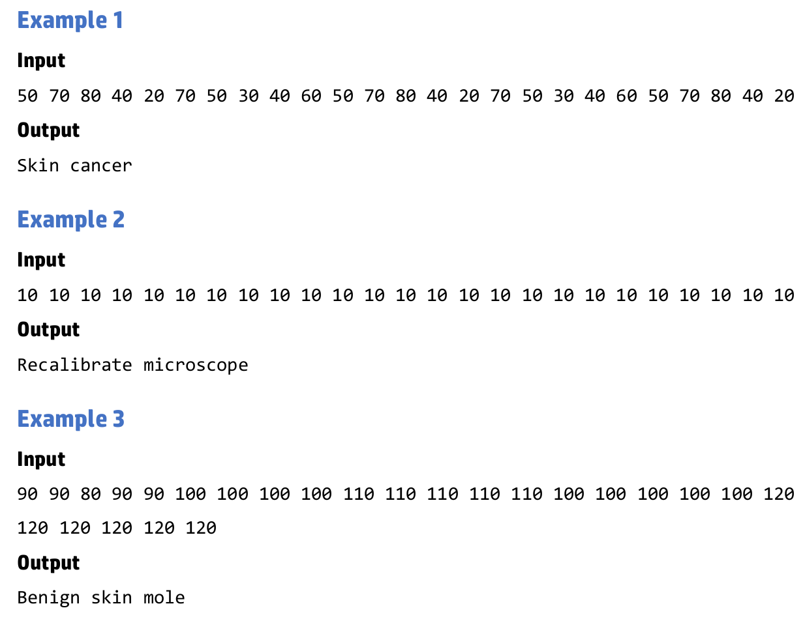

# (16) Cáncer de piel 

## Introducción 
La visión artificial es un campo amplio que se incrementará en los próximos años. El diagnóstico automatizado de enfermedades también será un campo importante. Hoy fusionaremos ambos, creando un algoritmo que diagnostique el cáncer de piel. 

Para ello, el algoritmo tiene que evaluar la media de los valores obtenidos y su desviación estándar (stdev). Recuerde que la fórmula de desviación estándar es: 

donde:
`xi = {x1, x2, x3, ...}` son los valores observados de los elementos de la muestra, 
`x̅` es el valor medio de estas observaciones
`N` es el número de observaciones en la muestra. 

Su algoritmo se alimentará con imágenes de un microscopio compuesto por una matriz de píxeles de escala de grises de `5x5`. 
- 0: significa un píxel oscuro 
- 255: uno blanco. 
  
En este detector simple, podemos considerar:
- Un **cáncer de piel** si `40 ≤ promedio ≤ 80` y `stdev ≥10`.  Si `stdev` es más bajo, es un **lunar cutáneo benigno** de la piel (benigno es un término médico para indicar que no es peligroso). 
- También se considera un **lunar cutáneo benigno** si `80 < promedio ≤ 230`. Independiente de la desviación estándar. 
- La **calibración del microscopio** es necesaria cuando: `promedio < 40 o promedio > 230`. Independiente de la desviación estándar. 
  
> SUGERENCIA: realice todas las operaciones como flotantes.  

## Entrada 

- El nombre de archivo se pasará por línea de comandos: `$ battleRoyal test-1.in`
- La entrada consta de una línea de 25 enteros separados por espacios. 

## Salida 
- La salida será en un archivo con el mismo nombre que el de entrada, pero con la extensión `ans`: `test-1.ans`
- Imprimir una de las siguientes clasificaciones de salida: 
    - Cáncer de piel 
    - Lunar de piel benigno 
    - Recalibrar microscopio 

## Ejemplos

